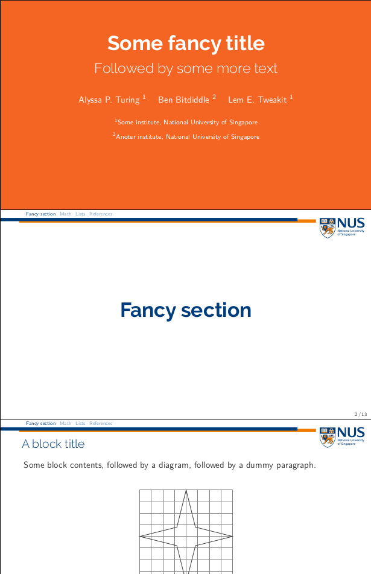
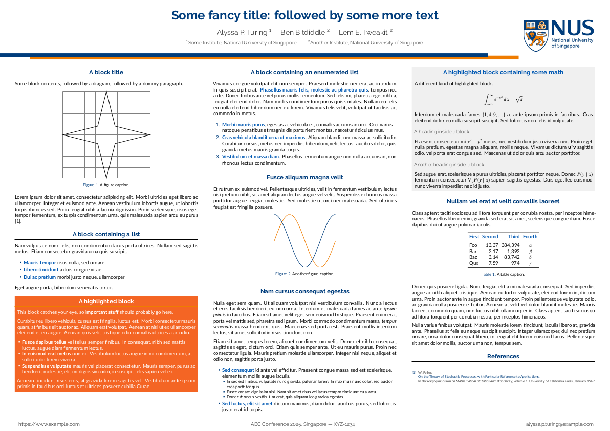

# NUS Beamer Theme

In this repo you will find LaTex Beamer themes that I developed during my studies at the National University of Singapore (NUS) for [slides](./slides.pdf) and [conference posters](./poster.pdf). 

The themes attempt to maximize the space reserved for content while providing enough visual elements to identify the documents with NUS. The themes use a minimal divider at the header, while not sacrificing the university logo. They reduce empty spaces at headers and footers, which are often wasteed in other Beamer templates.  Visual elements attempt to follow the [visual identity guidelines](https://nus.edu.sg/identity/guidelines/corporate-colours) defined by the university.

[**Slides**](./slides.pdf)

[**Conference poster**](./poster.pdf). 

Anyone is free to use these themes, but please follow university guidelines.
